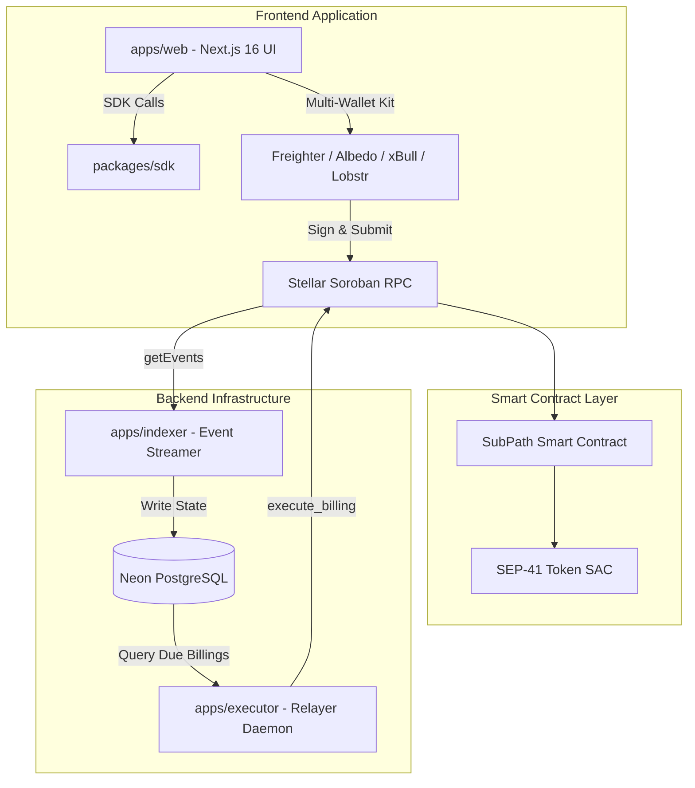

<div align="center">

# SubPath Application & Infrastructure

**Full-stack web application, SDK, event indexer, and autonomous billing executor for SubPath on Stellar Soroban.**

[](https://github.com/SubPath-Protocol/subpath-app/actions)
[](https://subpath-app.vercel.app)
[](https://stellar.expert/explorer/testnet/contract/CC4ZFZ64RQ6CG3PTBNDB4A6YB7SJEW2NZ56YNNBBZVC7HDQTNIKWLUV3)
[](LICENSE)
[](https://github.com/SubPath-Protocol/subpath-app/releases)

</div>

---

## Live Deployments & Testnet Verification

* **Live Web Application**: [https://subpath-app.vercel.app](https://subpath-app.vercel.app)
* **Testnet Contract ID**: [`CC4ZFZ64RQ6CG3PTBNDB4A6YB7SJEW2NZ56YNNBBZVC7HDQTNIKWLUV3`](https://stellar.expert/explorer/testnet/contract/CC4ZFZ64RQ6CG3PTBNDB4A6YB7SJEW2NZ56YNNBBZVC7HDQTNIKWLUV3)
* **Network**: Stellar Testnet (`Test SDF Network ; September 2015`)
* **Deployment Evidence**: [docs/deployment-verification.md](docs/deployment-verification.md)
* **On-Chain Lifecycle Evidence**: [docs/testnet-verification.md](docs/testnet-verification.md)

---

## Architecture Overview



---

## Monorepo Packages

| Package | Path | Role | Tech Stack |
| :--- | :--- | :--- | :--- |
| **`web`** | `apps/web` | Web Dashboard and hosted subscription checkout | Next.js 16, Turbopack, Tailwind CSS, StellarWalletsKit |
| **`@subpath/sdk`** | `packages/sdk` | Client SDK wrapping Soroban RPC transactions | TypeScript, `@stellar/stellar-sdk` |
| **`indexer`** | `apps/indexer` | Background daemon streaming contract events | Node.js, Prisma ORM, Neon PostgreSQL |
| **`executor`** | `apps/executor` | Autonomous billing daemon executing due payments | Node.js, Prisma ORM, Stellar SDK |

---

## Multi-Wallet Support

The web application integrates `@creit.tech/stellar-wallets-kit`, enabling access across both desktop and mobile environments:
* **Albedo**: Zero-install web popup working on any phone, tablet, or browser without extensions.
* **Freighter**: The official Stellar browser extension.
* **xBull**: Browser extension and web bridge.
* **LOBSTR**: Mobile wallet and signer extension.
* **Rabet & Hana**: Popular multi-chain and Stellar extensions.

---

## Local Development Setup

### Prerequisites
* Node.js v20+ or v22+
* `pnpm` v9.12.1+

### Installation & Build
```bash
# Clone the repository
git clone https://github.com/SubPath-Protocol/subpath-app.git
cd subpath-app

# Install workspace dependencies
pnpm install

# Build the client SDK
pnpm --filter @subpath/sdk build

# Generate database schema client
pnpm db:generate

# Start the web app locally
pnpm --filter web dev
```

### Environment Variables
Configure `.env` or `.env.local` following `.env.example`:

| Variable | Description | Example / Target |
| :--- | :--- | :--- |
| `NEXT_PUBLIC_STELLAR_NETWORK` | Stellar network environment | `testnet` |
| `NEXT_PUBLIC_STELLAR_RPC_URL` | Soroban RPC provider endpoint | `https://soroban-testnet.stellar.org` |
| `NEXT_PUBLIC_STELLAR_PASSPHRASE` | Network passphrase | `Test SDF Network ; September 2015` |
| `NEXT_PUBLIC_SUBPATH_CONTRACT_ID` | Deployed core contract address | `CC4ZFZ64RQ6CG3PTBNDB4A6YB7SJEW2NZ56YNNBBZVC7HDQTNIKWLUV3` |
| `DATABASE_URL` | PostgreSQL connection string | `postgresql://...` (Neon Serverless) |
| `EXECUTOR_SECRET_KEY` | Relayer fee funding keypair | `S...` (Testnet account) |

---

## Workspace Commands

```bash
# Typecheck all packages
pnpm typecheck

# Lint workspace
pnpm lint

# Run unit tests
pnpm test

# Production workspace build
pnpm build
```

---

## Cloud Daemon Deployment

To run the background workers (`indexer` and `executor`) continuously in the cloud:

* **Docker Compose (VPS / Cloud Server)**:
  ```bash
  docker compose up -d --build
  ```
* **Render (1-Click Blueprint)**: Deploy background workers using [`render.yaml`](render.yaml).
* **Railway**: Deploy services targeting [`Dockerfile.indexer`](Dockerfile.indexer) and [`Dockerfile.executor`](Dockerfile.executor).

Full setup instructions are available in the [Operations Runbook](docs/operations.md).

---

## Documentation Links

* [Architecture & Monorepo Overview](docs/architecture.md)
* [Infrastructure & Daemon Design](docs/infrastructure.md)
* [Operations Runbook](docs/operations.md)
* [Testnet Lifecycle Verification](docs/testnet-verification.md)
* [Vercel Deployment Verification](docs/deployment-verification.md)
* [Changelog](CHANGELOG.md)
* [Roadmap](ROADMAP.md)

---

## Limitations

* **Testnet Prototype**: Evaluated on Stellar Testnet only. Not audited for Mainnet financial deployments.
* **Worker Daemons**: Recurring billing automation relies on persistent background processes (`apps/indexer`, `apps/executor`) rather than serverless functions.
* **Allowance Prerequisite**: Recurring charges require active subscriber token allowances authorized via client wallets.

---

## Contributing & License

Contributions are welcome. Please read [CONTRIBUTING.md](CONTRIBUTING.md), [SECURITY.md](SECURITY.md), and [CODE_OF_CONDUCT.md](CODE_OF_CONDUCT.md).

Licensed under the [MIT License](LICENSE).
