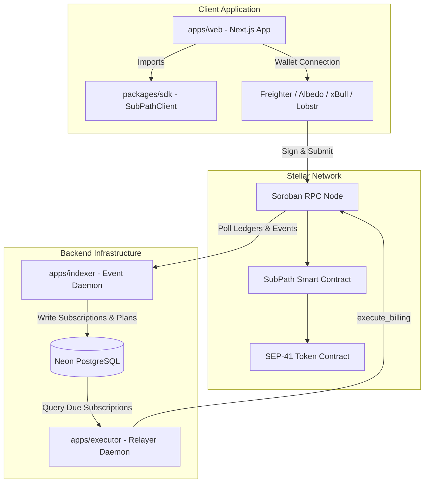

# SubPath Monorepo Architecture

## Overview

SubPath is structured as a `pnpm` monorepo containing the TypeScript SDK, web frontend application, Soroban ledger event indexer, and permissionless automated recurring billing executor.



## Workspace Structure

The monorepo contains four packages organized under `apps/` and `packages/`:

```text
subpath-app/
├── apps/
│   ├── web/        # Next.js 16 Web Dashboard & Subscription Checkout UI
│   ├── indexer/    # Soroban ledger event poller and Neon DB state synchronizer
│   └── executor/   # Automated recurring billing execution daemon
├── packages/
│   └── sdk/        # TypeScript client SDK for SubPath contract interactions
├── docs/           # Verification, operations, and architectural documentation
└── vercel.json     # Vercel monorepo deployment build specification
```

## Package Roles & Responsibilities

### 1. `@subpath/sdk` (`packages/sdk`)
* **Role**: Type-safe client library wrapping Soroban RPC interactions and contract invocations.
* **Key Functions**:
  * `createPlan(merchant, token, amount, cycleSeconds)`
  * `subscribe(subscriber, planId)`
  * `pauseSubscription(subscriber, planId)`
  * `resumeSubscription(subscriber, planId)`
  * `cancelSubscription(subscriber, planId)`
  * `executeBilling(subscriber, planId)`
  * `getPlan(planId)`, `getSubscription(subscriber, planId)`

### 2. `web` (`apps/web`)
* **Role**: Next.js 16 web application with App Router, Turbopack, and Tailwind CSS.
* **Features**:
  * Merchant Dashboard (`/dashboard`): Plan creation and subscriber overview.
  * Plan Checkout (`/plans/[planId]`): Public hosted subscription onboarding page.
  * StellarWalletsKit Integration: Seamless wallet connection supporting Freighter (extension), Albedo (zero-install web popup for mobile & desktop), xBull, Lobstr, Rabet, and Hana.
  * Purely non-custodial: Directly constructs transactions and prompts subscriber wallets to sign.

### 3. `indexer` (`apps/indexer`)
* **Role**: Persistent background event streaming service.
* **Operation**:
  * Periodically polls the latest Stellar Soroban ledgers via `getEvents`.
  * Filters for `plan_add`, `sub_new`, `sub_billed`, `sub_pause`, `sub_resume`, and `sub_end`.
  * Atomically writes plans, subscriptions, and billing audit logs into Neon PostgreSQL via Prisma ORM.
  * Maintains an idempotent cursor in `IndexerState` to ensure zero duplicate event ingestions.

### 4. `executor` (`apps/executor`)
* **Role**: Autonomous billing relayer daemon.
* **Operation**:
  * Periodically scans Neon PostgreSQL for active subscriptions where `nextBillingTime <= currentTimestamp`.
  * Verifies subscriber token allowances against the SubPath contract.
  * Constructs and signs `execute_billing(subscriber, planId)` transactions using a funded operator keypair.
  * Submits transactions to Soroban RPC, updating next billing dates upon confirmation.
